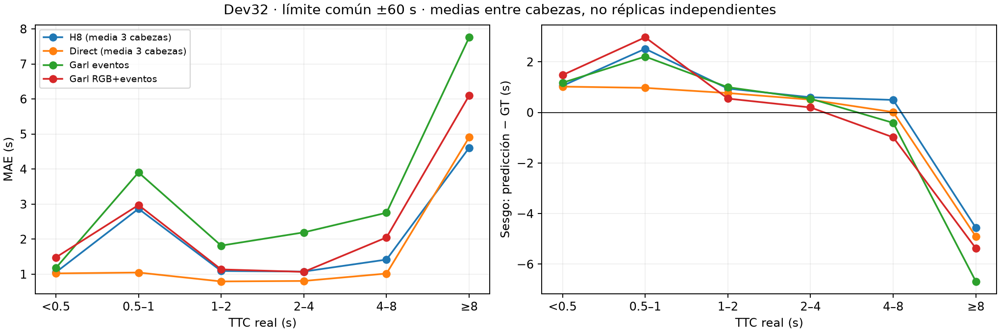
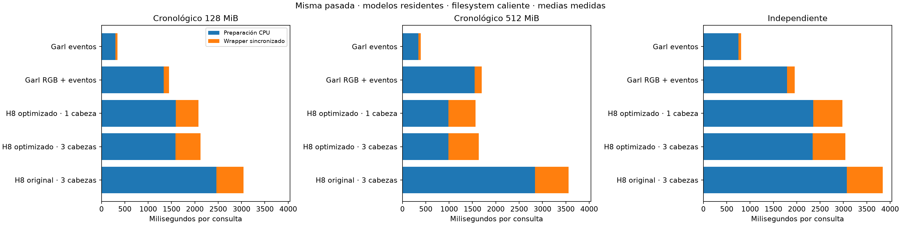

# Revisión V12: resultados medidos

Informe generado por `python -m operational.ttc_revision.report`. Los datos originales de la campaña del 8 de octubre permanecen intactos. [Protocolo y comandos](PROTOCOL.md).

DEV32: la salida fija mediana de tres cabezas pasa de MAE 1.3766 s (H8) a 1.0729 s (Direct), -22.07 %.
Avisos urgentes en DEV32: fallos 98.32 % (H8) → 100.00 % (Direct), sobre 119 consultas con GT positivo ≤1 s. El aviso exige una predicción positiva ≤1 s; una mejora de MAE no garantiza mejorar este criterio.
TTC ≥8 s en DEV32: MAE 4.5864 → 4.8908 s; sesgo -4.5759 → -4.8908 s.
FCWD: la salida fija mediana de tres cabezas pasa de MAE 1.6249 s (H8) a 1.7711 s (Direct), +9.00 %.
TTC ≥8 s en FCWD: MAE 4.6467 → 5.3173 s; sesgo -4.5761 → -5.3173 s.

## Precisión

Los tres checkpoints nuevos son endpoints fijos de 2.500 actualizaciones sobre TRAIN40. Dev32 y FCWD son poblaciones de diagnóstico ya conocidas, no tests ciegos. Las semillas comparten productores. Ninguna métrica certifica SOTA. El replay no consulta GT TTC al inferir, pero consume las ROI oráculo del manifest; `targets_read=false` se refiere al TTC, no a esas anotaciones.

### Problemas que motivan los cambios

H8 aprende error en fase, no MAE en segundos. Cerca de fase cero, TTC ≈ 0.1/fase: una pequeña desviación puede producir un error grande o cambiar el signo. El decodificador limita magnitud a 60 s y cambia entre −60 y +60 al cruzar cero. El residual original es lineal y no está restringido al intervalo de los expertos. Direct elimina ese salto mediante una salida continua; su beneficio de generalización debe medirse.

La subestimación de TTC largos coincide con una supervisión TRAIN40 concentrada entre −10 y +10 s y un cambio de dominio. Los productores congelados solo aportan 17 características por observación: cambiar la cabeza no recupera información visual perdida. Los grupos y diagnósticos publicados localizan asociaciones, no demuestran por sí solos causalidad.

### Ajuste sobre TRAIN40

Evaluación descriptiva de los endpoints sobre las 88.744 consultas ya utilizadas al entrenar. Es error sin ponderar en entrenamiento, no validación ni evidencia de generalización. No consume actualizaciones.

| method | cohort | n | mae | bias | sign_error_fraction |
| --- | --- | --- | --- | --- | --- |
| H8_median3 | all | 88744 | 1.7132 | -0.0473 | 0.0226 |
| H8_median3 | negative | 37043 | 2.5010 | 0.5693 | 0.0481 |
| H8_median3 | positive_at_most_1 | 336 | 0.5749 | 0.5181 | 0.0030 |
| H8_median3 | positive_1_4 | 17669 | 0.5532 | 0.1208 | 0.0024 |
| H8_median3 | positive_4_8 | 27317 | 1.1878 | -0.5027 | 0.0038 |
| H8_median3 | positive_at_least_8 | 6379 | 2.6613 | -2.1726 | 0.0111 |
| Direct_median3 | all | 88744 | 1.2474 | -0.0482 | 0.0205 |
| Direct_median3 | negative | 37043 | 1.4368 | 0.9797 | 0.0427 |
| Direct_median3 | positive_at_most_1 | 336 | 0.3934 | 0.3838 | 0.0030 |
| Direct_median3 | positive_1_4 | 17669 | 0.4681 | -0.0164 | 0.0026 |
| Direct_median3 | positive_4_8 | 27317 | 1.1359 | -0.8196 | 0.0044 |
| Direct_median3 | positive_at_least_8 | 6379 | 2.8293 | -2.8246 | 0.0111 |

La subestimación larga ya aparece en TRAIN40: sesgo para TTC ≥8 s de -2.1726 s en H8 y -2.8246 s en Direct. Por tanto, no puede atribuirse exclusivamente al cambio de dominio ni a los targets de transferencia superiores al rango de entrenamiento.

### DEV32

Salidas nativas:

| method | n | coverage | mae | median_ae | rmse | bias | rte_percent |
| --- | --- | --- | --- | --- | --- | --- | --- |
| H8_seed7 | 3640 | 1.0000 | 1.3613 | 0.7218 | 3.4754 | 0.4215 | 53.7009 |
| H8_seed13 | 3640 | 1.0000 | 1.3950 | 0.6992 | 3.6177 | 0.4205 | 54.5210 |
| H8_seed23 | 3640 | 1.0000 | 1.4565 | 0.7021 | 4.0031 | 0.5312 | 59.1450 |
| H8_median3 | 3640 | 1.0000 | 1.3766 | 0.7052 | 3.3317 | 0.4432 | 54.4887 |
| Direct_seed7 | 3640 | 1.0000 | 1.0671 | 0.6412 | 1.7806 | 0.2407 | 37.5033 |
| Direct_seed13 | 3640 | 1.0000 | 1.0796 | 0.6706 | 1.8111 | 0.1695 | 37.8655 |
| Direct_seed23 | 3640 | 1.0000 | 1.0878 | 0.6728 | 1.8850 | 0.1621 | 37.3557 |
| Direct_median3 | 3640 | 1.0000 | 1.0729 | 0.6507 | 1.8074 | 0.1879 | 37.3212 |
| public_Garl_event_lhr | 3640 | 1.0000 | 4.5597 | 0.9578 | 83.8961 | 1.2534 | 161.1207 |
| public_Garl_rgb_event_full | 3640 | 1.0000 | 94.5096 | 0.6614 | 5561.6218 | 91.3537 | 5180.1817 |

Mismo límite operativo de ±60 s para todos los valores finitos:

| method | n | coverage | mae | median_ae | rmse | bias | rte_percent |
| --- | --- | --- | --- | --- | --- | --- | --- |
| H8_seed7 | 3640 | 1.0000 | 1.3613 | 0.7218 | 3.4754 | 0.4215 | 53.7009 |
| H8_seed13 | 3640 | 1.0000 | 1.3950 | 0.6992 | 3.6177 | 0.4205 | 54.5210 |
| H8_seed23 | 3640 | 1.0000 | 1.4565 | 0.7021 | 4.0031 | 0.5312 | 59.1450 |
| H8_median3 | 3640 | 1.0000 | 1.3766 | 0.7052 | 3.3317 | 0.4432 | 54.4887 |
| Direct_seed7 | 3640 | 1.0000 | 1.0671 | 0.6412 | 1.7806 | 0.2407 | 37.5033 |
| Direct_seed13 | 3640 | 1.0000 | 1.0796 | 0.6706 | 1.8111 | 0.1695 | 37.8655 |
| Direct_seed23 | 3640 | 1.0000 | 1.0878 | 0.6728 | 1.8850 | 0.1621 | 37.3557 |
| Direct_median3 | 3640 | 1.0000 | 1.0729 | 0.6507 | 1.8074 | 0.1879 | 37.3212 |
| public_Garl_event_lhr | 3640 | 1.0000 | 2.5703 | 0.9578 | 7.0609 | 0.1152 | 96.1948 |
| public_Garl_rgb_event_full | 3640 | 1.0000 | 1.6433 | 0.6614 | 5.0284 | -0.1881 | 59.6877 |

MAE, media ± desviación entre cabezas: H8 1.4042 ± 0.0483 s; Direct 1.0781 ± 0.0104 s (-23.22 %). Esta media describe tres cabezas sobre los mismos productores; no son réplicas independientes del sistema completo.

Diferencia de MAE de la mediana fija Direct menos cada comparador; un valor negativo favorece Direct. IC del 95 % por clusters:

| right | grouping | status | difference_mae | ci_low | ci_high |
| --- | --- | --- | --- | --- | --- |
| public_Garl_event_lhr | sequence_id | COMPLETE | -3.4868 | -6.6717 | -1.5128 |
| public_Garl_event_lhr | scenario_family | COMPLETE | -3.4868 | -6.3791 | -1.9586 |
| public_Garl_rgb_event_full | sequence_id | COMPLETE | -93.4367 | -295.4792 | -0.4804 |
| public_Garl_rgb_event_full | scenario_family | COMPLETE | -93.4367 | -237.4663 | -0.3066 |
| H8_median3 | sequence_id | COMPLETE | -0.3038 | -0.5616 | -0.1122 |
| H8_median3 | scenario_family | COMPLETE | -0.3038 | -0.5827 | -0.0617 |

Errores y sesgo por familia, usando una salida fija por sistema:

| method | cohort | n | mae | bias | p95_ae |
| --- | --- | --- | --- | --- | --- |
| H8_median3 | family:CCRm | 914 | 1.3366 | -1.0565 | 5.9691 |
| H8_median3 | family:CCRs-1 | 948 | 1.4477 | 1.1459 | 4.9347 |
| H8_median3 | family:CCRs-2 | 406 | 0.6638 | 0.0685 | 2.2683 |
| H8_median3 | family:CCRs-3 | 250 | 0.5722 | 0.0456 | 1.7102 |
| H8_median3 | family:CCRs-side | 387 | 1.3036 | 0.9897 | 2.9235 |
| H8_median3 | family:CPLA | 291 | 2.0096 | 1.5203 | 3.7207 |
| H8_median3 | family:CPNA | 239 | 1.6336 | 1.4503 | 2.8193 |
| H8_median3 | family:CPNAO | 205 | 2.5596 | 1.3722 | 6.7762 |
| Direct_median3 | family:CCRm | 914 | 1.3790 | -1.1525 | 6.7918 |
| Direct_median3 | family:CCRs-1 | 948 | 0.8641 | 0.6480 | 3.3346 |
| Direct_median3 | family:CCRs-2 | 406 | 0.6677 | 0.0343 | 2.2123 |
| Direct_median3 | family:CCRs-3 | 250 | 0.5523 | -0.0013 | 1.6182 |
| Direct_median3 | family:CCRs-side | 387 | 1.2083 | 0.8388 | 2.7461 |
| Direct_median3 | family:CPLA | 291 | 1.2689 | 1.2035 | 2.7593 |
| Direct_median3 | family:CPNA | 239 | 1.2011 | 0.9489 | 2.2967 |
| Direct_median3 | family:CPNAO | 205 | 1.4274 | 1.0132 | 3.5853 |

Errores por intervalo de TTC positivo; todos los seeds se conservan en CSV:

| method | cohort | n | mae | bias |
| --- | --- | --- | --- | --- |
| H8_seed7 | positive_0_0.5 | 3 | 1.1061 | 1.1061 |
| H8_seed7 | positive_0.5_1 | 116 | 2.3775 | 1.9265 |
| H8_seed7 | positive_1_2 | 993 | 1.1184 | 0.9577 |
| H8_seed7 | positive_2_4 | 1484 | 1.0469 | 0.7110 |
| H8_seed7 | positive_4_8 | 851 | 1.2172 | 0.3235 |
| H8_seed7 | positive_8_inf | 193 | 5.0567 | -5.0471 |
| Direct_seed7 | positive_0_0.5 | 3 | 1.0390 | 1.0390 |
| Direct_seed7 | positive_0.5_1 | 116 | 0.9908 | 0.9305 |
| Direct_seed7 | positive_1_2 | 993 | 0.7845 | 0.7583 |
| Direct_seed7 | positive_2_4 | 1484 | 0.8420 | 0.5455 |
| Direct_seed7 | positive_4_8 | 851 | 1.0076 | 0.0973 |
| Direct_seed7 | positive_8_inf | 193 | 4.5594 | -4.5594 |
| public_Garl_event_lhr | positive_0_0.5 | 3 | 1.1757 | 1.1757 |
| public_Garl_event_lhr | positive_0.5_1 | 116 | 4.5447 | 2.8509 |
| public_Garl_event_lhr | positive_1_2 | 993 | 2.0888 | 1.2595 |
| public_Garl_event_lhr | positive_2_4 | 1484 | 6.1841 | 3.0769 |
| public_Garl_event_lhr | positive_4_8 | 851 | 3.4149 | 0.1320 |
| public_Garl_event_lhr | positive_8_inf | 193 | 9.8924 | -8.8134 |
| public_Garl_rgb_event_full | positive_0_0.5 | 3 | 1.4787 | 1.4787 |
| public_Garl_rgb_event_full | positive_0.5_1 | 116 | 3.0887 | 3.0869 |
| public_Garl_rgb_event_full | positive_1_2 | 993 | 340.1031 | 337.2806 |
| public_Garl_rgb_event_full | positive_2_4 | 1484 | 1.2934 | -0.0288 |
| public_Garl_rgb_event_full | positive_4_8 | 851 | 3.1765 | -2.0686 |
| public_Garl_rgb_event_full | positive_8_inf | 193 | 6.7729 | -4.9304 |

Aviso urgente (GT positivo ≤1 s):

| method | urgent_n | urgent_miss_fraction | urgent_false_alarm_fraction |
| --- | --- | --- | --- |
| H8_seed7 | 119.0000 | 1.0000 | 0.0000 |
| H8_seed13 | 119.0000 | 0.9664 | 0.0000 |
| H8_seed23 | 119.0000 | 0.9832 | 0.0000 |
| H8_median3 | 119.0000 | 0.9832 | 0.0000 |
| Direct_seed7 | 119.0000 | 1.0000 | 0.0014 |
| Direct_seed13 | 119.0000 | 0.9832 | 0.0014 |
| Direct_seed23 | 119.0000 | 0.9328 | 0.0023 |
| Direct_median3 | 119.0000 | 1.0000 | 0.0014 |
| public_Garl_event_lhr | 119.0000 | 1.0000 | 0.0000 |
| public_Garl_rgb_event_full | 119.0000 | 0.9748 | 0.0003 |

Un resultado negativo predicho para un contacto positivo urgente cuenta como fallo de aviso, no como una alarma correcta.

### FCWD

Salidas nativas:

| method | n | coverage | mae | median_ae | rmse | bias | rte_percent |
| --- | --- | --- | --- | --- | --- | --- | --- |
| H8_seed7 | 597 | 1.0000 | 1.7777 | 0.6750 | 3.5879 | -0.9679 | 30.1963 |
| H8_seed13 | 597 | 1.0000 | 1.5974 | 0.5797 | 3.2580 | -0.8639 | 27.4066 |
| H8_seed23 | 597 | 1.0000 | 1.5692 | 0.5978 | 3.1092 | -0.7853 | 27.4822 |
| H8_median3 | 597 | 1.0000 | 1.6249 | 0.6008 | 3.2871 | -0.8656 | 27.8555 |
| Direct_seed7 | 597 | 1.0000 | 1.7319 | 0.6314 | 3.5798 | -1.0315 | 28.3788 |
| Direct_seed13 | 597 | 1.0000 | 1.7619 | 0.6290 | 3.5795 | -1.0671 | 29.0787 |
| Direct_seed23 | 597 | 1.0000 | 1.8318 | 0.6210 | 3.8071 | -1.1039 | 29.8196 |
| Direct_median3 | 597 | 1.0000 | 1.7711 | 0.5910 | 3.6458 | -1.0703 | 28.9859 |
| public_Garl_event_lhr | 597 | 1.0000 | 2.1462 | 0.6017 | 5.0716 | -1.4873 | 26.8873 |
| public_Garl_rgb_event_full | 597 | 0.0000 | — | — | — | — | — |

Mismo límite operativo de ±60 s para todos los valores finitos:

| method | n | coverage | mae | median_ae | rmse | bias | rte_percent |
| --- | --- | --- | --- | --- | --- | --- | --- |
| H8_seed7 | 597 | 1.0000 | 1.7777 | 0.6750 | 3.5879 | -0.9679 | 30.1963 |
| H8_seed13 | 597 | 1.0000 | 1.5974 | 0.5797 | 3.2580 | -0.8639 | 27.4066 |
| H8_seed23 | 597 | 1.0000 | 1.5692 | 0.5978 | 3.1092 | -0.7853 | 27.4822 |
| H8_median3 | 597 | 1.0000 | 1.6249 | 0.6008 | 3.2871 | -0.8656 | 27.8555 |
| Direct_seed7 | 597 | 1.0000 | 1.7319 | 0.6314 | 3.5798 | -1.0315 | 28.3788 |
| Direct_seed13 | 597 | 1.0000 | 1.7619 | 0.6290 | 3.5795 | -1.0671 | 29.0787 |
| Direct_seed23 | 597 | 1.0000 | 1.8318 | 0.6210 | 3.8071 | -1.1039 | 29.8196 |
| Direct_median3 | 597 | 1.0000 | 1.7711 | 0.5910 | 3.6458 | -1.0703 | 28.9859 |
| public_Garl_event_lhr | 597 | 1.0000 | 2.1462 | 0.6017 | 5.0716 | -1.4873 | 26.8873 |
| public_Garl_rgb_event_full | 597 | 0.0000 | — | — | — | — | — |

MAE, media ± desviación entre cabezas: H8 1.6481 ± 0.1131 s; Direct 1.7752 ± 0.0513 s (+7.71 %). Esta media describe tres cabezas sobre los mismos productores; no son réplicas independientes del sistema completo.

Diferencia de MAE de la mediana fija Direct menos cada comparador; un valor negativo favorece Direct. IC del 95 % por clusters:

| right | grouping | status | difference_mae | ci_low | ci_high |
| --- | --- | --- | --- | --- | --- |
| public_Garl_event_lhr | sequence_id | COMPLETE | -0.3751 | -0.8390 | -0.0424 |
| public_Garl_event_lhr | scenario_family | COMPLETE | -0.3751 | -0.8390 | -0.0424 |
| public_Garl_rgb_event_full | sequence_id | UNAVAILABLE_INCOMPLETE_COHORT | — | — | — |
| public_Garl_rgb_event_full | scenario_family | UNAVAILABLE_INCOMPLETE_COHORT | — | — | — |
| H8_median3 | sequence_id | COMPLETE | 0.1462 | 0.0806 | 0.2556 |
| H8_median3 | scenario_family | COMPLETE | 0.1462 | 0.0806 | 0.2556 |

Errores y sesgo por familia, usando una salida fija por sistema:

| method | cohort | n | mae | bias | p95_ae |
| --- | --- | --- | --- | --- | --- |
| H8_median3 | family:FCWD1 | 201 | 2.3443 | -1.6915 | 13.5302 |
| H8_median3 | family:FCWD2 | 204 | 1.2765 | -0.5770 | 5.0009 |
| H8_median3 | family:FCWD3 | 192 | 1.2419 | -0.3076 | 4.4878 |
| Direct_median3 | family:FCWD1 | 201 | 2.5999 | -2.0036 | 14.0764 |
| Direct_median3 | family:FCWD2 | 204 | 1.3767 | -0.7006 | 5.7293 |
| Direct_median3 | family:FCWD3 | 192 | 1.3224 | -0.4860 | 4.9425 |

Errores por intervalo de TTC positivo; todos los seeds se conservan en CSV:

| method | cohort | n | mae | bias |
| --- | --- | --- | --- | --- |
| H8_seed7 | positive_0_0.5 | 0 | — | — |
| H8_seed7 | positive_0.5_1 | 0 | — | — |
| H8_seed7 | positive_1_2 | 129 | 0.8843 | 0.8843 |
| H8_seed7 | positive_2_4 | 142 | 0.4921 | 0.2920 |
| H8_seed7 | positive_4_8 | 178 | 0.6490 | 0.0973 |
| H8_seed7 | positive_8_inf | 148 | 5.1475 | -5.0722 |
| Direct_seed7 | positive_0_0.5 | 0 | — | — |
| Direct_seed7 | positive_0.5_1 | 0 | — | — |
| Direct_seed7 | positive_1_2 | 129 | 0.8168 | 0.8168 |
| Direct_seed7 | positive_2_4 | 142 | 0.4677 | 0.2167 |
| Direct_seed7 | positive_4_8 | 178 | 0.5432 | 0.0762 |
| Direct_seed7 | positive_8_inf | 148 | 5.1723 | -5.1723 |
| public_Garl_event_lhr | positive_0_0.5 | 0 | — | — |
| public_Garl_event_lhr | positive_0.5_1 | 0 | — | — |
| public_Garl_event_lhr | positive_1_2 | 129 | 0.3340 | 0.2651 |
| public_Garl_event_lhr | positive_2_4 | 142 | 0.3694 | -0.1039 |
| public_Garl_event_lhr | positive_4_8 | 178 | 1.2961 | -0.0192 |
| public_Garl_event_lhr | positive_8_inf | 148 | 6.4529 | -6.1078 |
| public_Garl_rgb_event_full | positive_0_0.5 | 0 | — | — |
| public_Garl_rgb_event_full | positive_0.5_1 | 0 | — | — |
| public_Garl_rgb_event_full | positive_1_2 | 129 | — | — |
| public_Garl_rgb_event_full | positive_2_4 | 142 | — | — |
| public_Garl_rgb_event_full | positive_4_8 | 178 | — | — |
| public_Garl_rgb_event_full | positive_8_inf | 148 | — | — |

## Diagnóstico de productores y cambio de dominio

Predicciones reconstruidas desde las fases FP32 almacenadas, usando el decodificador H8 con límite ±60 s. Son diagnósticos posteriores al entrenamiento, no predicciones nativas exactas de cada productor ni nuevos baselines oficiales. La mediana de fases usa solo predicciones, sin elegir un experto mediante GT.

Convenciones temporales: la fracción del canal 1 con discrepancia mayor que 1 µs es 0.0000. En el canal 3, la diferencia mediana es 1.704 ms y el p99 19.992 ms. No se ha demostrado que esta diferencia explique el error de transferencia.

| population | method | cohort | n | mae | bias |
| --- | --- | --- | --- | --- | --- |
| dev32 | A5_phase_bound60 | all | 3640 | 3.8638 | 1.2982 |
| dev32 | A5_phase_bound60 | positive_at_most_1 | 119 | 6.9947 | 3.4161 |
| dev32 | A5_phase_bound60 | positive_at_least_8 | 193 | 11.9853 | -0.6536 |
| dev32 | C2F_phase_bound60 | all | 3640 | 4.0668 | 1.7846 |
| dev32 | C2F_phase_bound60 | positive_at_most_1 | 119 | 7.1163 | 3.1799 |
| dev32 | C2F_phase_bound60 | positive_at_least_8 | 193 | 15.7368 | 3.4954 |
| dev32 | PAIR_phase_bound60 | all | 3640 | 2.6625 | 0.8362 |
| dev32 | PAIR_phase_bound60 | positive_at_most_1 | 119 | 5.4058 | -0.3277 |
| dev32 | PAIR_phase_bound60 | positive_at_least_8 | 193 | 7.9931 | -0.2460 |
| dev32 | current_phase_median_bound60 | all | 3640 | 3.5386 | 1.3647 |
| dev32 | current_phase_median_bound60 | positive_at_most_1 | 119 | 6.7829 | 3.8790 |
| dev32 | current_phase_median_bound60 | positive_at_least_8 | 193 | 11.2064 | 0.8321 |
| dev32 | H8_median3 | all | 3640 | 1.3766 | 0.4432 |
| dev32 | H8_median3 | positive_at_most_1 | 119 | 2.7568 | 2.4381 |
| dev32 | H8_median3 | positive_at_least_8 | 193 | 4.5864 | -4.5759 |
| dev32 | Direct_median3 | all | 3640 | 1.0729 | 0.1879 |
| dev32 | Direct_median3 | positive_at_most_1 | 119 | 1.0038 | 0.9449 |
| dev32 | Direct_median3 | positive_at_least_8 | 193 | 4.8908 | -4.8908 |
| fcwd | A5_phase_bound60 | all | 597 | 3.1023 | 0.5807 |
| fcwd | A5_phase_bound60 | positive_at_most_1 | 0 | — | — |
| fcwd | A5_phase_bound60 | positive_at_least_8 | 148 | 9.1610 | -0.8217 |
| fcwd | C2F_phase_bound60 | all | 597 | 3.5437 | 1.4999 |
| fcwd | C2F_phase_bound60 | positive_at_most_1 | 0 | — | — |
| fcwd | C2F_phase_bound60 | positive_at_least_8 | 148 | 9.9102 | 1.9216 |
| fcwd | PAIR_phase_bound60 | all | 597 | 2.7020 | -0.3491 |
| fcwd | PAIR_phase_bound60 | positive_at_most_1 | 0 | — | — |
| fcwd | PAIR_phase_bound60 | positive_at_least_8 | 148 | 8.3626 | -2.6482 |
| fcwd | current_phase_median_bound60 | all | 597 | 2.9873 | 0.3762 |
| fcwd | current_phase_median_bound60 | positive_at_most_1 | 0 | — | — |
| fcwd | current_phase_median_bound60 | positive_at_least_8 | 148 | 8.8662 | -1.3629 |
| fcwd | H8_median3 | all | 597 | 1.6249 | -0.8656 |
| fcwd | H8_median3 | positive_at_most_1 | 0 | — | — |
| fcwd | H8_median3 | positive_at_least_8 | 148 | 4.6467 | -4.5761 |
| fcwd | Direct_median3 | all | 597 | 1.7711 | -1.0703 |
| fcwd | Direct_median3 | positive_at_most_1 | 0 | — | — |
| fcwd | Direct_median3 | positive_at_least_8 | 148 | 5.3173 | -5.3173 |

Fracción del error absoluto concentrada en cada intervalo. Se muestran las salidas fijas de tres cabezas:

| population | method | cohort | n | query_fraction | absolute_error_fraction |
| --- | --- | --- | --- | --- | --- |
| dev32 | H8_median3 | positive_at_most_1 | 119 | 0.0327 | 0.0655 |
| dev32 | H8_median3 | positive_1_4 | 2477 | 0.6805 | 0.5215 |
| dev32 | H8_median3 | positive_4_8 | 851 | 0.2338 | 0.2364 |
| dev32 | H8_median3 | positive_at_least_8 | 193 | 0.0530 | 0.1766 |
| dev32 | H8_median3 | negative | 0 | 0.0000 | 0.0000 |
| dev32 | Direct_median3 | positive_at_most_1 | 119 | 0.0327 | 0.0306 |
| dev32 | Direct_median3 | positive_1_4 | 2477 | 0.6805 | 0.5083 |
| dev32 | Direct_median3 | positive_4_8 | 851 | 0.2338 | 0.2194 |
| dev32 | Direct_median3 | positive_at_least_8 | 193 | 0.0530 | 0.2417 |
| dev32 | Direct_median3 | negative | 0 | 0.0000 | 0.0000 |
| fcwd | H8_median3 | positive_at_most_1 | 0 | 0.0000 | 0.0000 |
| fcwd | H8_median3 | positive_1_4 | 271 | 0.4539 | 0.1755 |
| fcwd | H8_median3 | positive_4_8 | 178 | 0.2982 | 0.1156 |
| fcwd | H8_median3 | positive_at_least_8 | 148 | 0.2479 | 0.7089 |
| fcwd | H8_median3 | negative | 0 | 0.0000 | 0.0000 |
| fcwd | Direct_median3 | positive_at_most_1 | 0 | 0.0000 | 0.0000 |
| fcwd | Direct_median3 | positive_1_4 | 271 | 0.4539 | 0.1657 |
| fcwd | Direct_median3 | positive_4_8 | 178 | 0.2982 | 0.0900 |
| fcwd | Direct_median3 | positive_at_least_8 | 148 | 0.2479 | 0.7443 |
| fcwd | Direct_median3 | negative | 0 | 0.0000 | 0.0000 |

Características con más observaciones fuera de los percentiles 0,5–99,5 de TRAIN40, calculados sin ponderación sobre las observaciones actuales. Se usa toda la población sensorial, incluso filas sin GT elegible. Esta fracción no es una probabilidad OOD calibrada ni demuestra causalidad:

| population | feature | train_median | transfer_median | outside_train_envelope_fraction |
| --- | --- | --- | --- | --- |
| fcwd | log_roi_rate | 13.3350 | 13.7501 | 0.0984 |
| fcwd | log_roi_count | 11.0325 | 11.4475 | 0.0984 |
| fcwd | a5_log_variance | 1.1002 | 0.6277 | 0.0968 |
| fcwd | c2f_log_variance | 1.1750 | 0.8818 | 0.0746 |
| dev32 | a5_log_variance | 1.1002 | 0.3075 | 0.0481 |
| dev32 | c2f_log_variance | 1.1750 | 0.1470 | 0.0454 |
| dev32 | log_roi_rate | 13.3350 | 13.0999 | 0.0431 |
| dev32 | log_roi_count | 11.0325 | 10.7973 | 0.0431 |
| dev32 | abs_pair_minus_a5 | 0.0023 | 0.0031 | 0.0177 |
| dev32 | abs_pair_minus_c2f | 0.0027 | 0.0037 | 0.0167 |
| fcwd | abs_c2f_minus_a5 | 0.0016 | 0.0017 | 0.0111 |
| fcwd | c2f_confidence | 8.8370 | 8.9751 | 0.0095 |

## Latencia

| mode | system | n | cpu_ms | wrapper_ms | e2e_ms | e2e_p50_ms | e2e_p95_ms | cuda_stream_ms | raw_cache_hit_fraction |
| --- | --- | --- | --- | --- | --- | --- | --- | --- | --- |
| chronological_raw_cache_enabled | garl_event_only | 200 | 299.5392 | 41.2890 | 340.8282 | 289.7189 | 709.2825 | 40.5710 | 0.8000 |
| chronological_raw_cache_enabled | garl_full | 200 | 1331.9843 | 116.0647 | 1448.0489 | 1365.6507 | 1893.0189 | 115.2648 | 0.0000 |
| chronological_raw_cache_enabled | h8_fast_one | 200 | 1592.0268 | 482.5458 | 2074.5726 | 2342.2445 | 3327.6201 | 481.7520 | 0.3000 |
| chronological_raw_cache_enabled | h8_fast_three | 200 | 1587.4328 | 535.0093 | 2122.4421 | 2395.1914 | 3309.1980 | 534.2196 | 0.3000 |
| chronological_raw_cache_enabled | h8_legacy_three | 200 | 2463.8064 | 579.6418 | 3043.4481 | 3096.3109 | 4235.2784 | 578.8692 | 0.0000 |
| chronological_raw_cache_enabled_512MiB | garl_event_only | 200 | 343.3847 | 50.4272 | 393.8119 | 335.3041 | 817.9028 | 49.6511 | 0.8000 |
| chronological_raw_cache_enabled_512MiB | garl_full | 200 | 1549.4087 | 151.9372 | 1701.3459 | 1728.7795 | 2011.4964 | 151.0766 | 0.0000 |
| chronological_raw_cache_enabled_512MiB | h8_fast_one | 200 | 987.5668 | 578.7906 | 1566.3574 | 1331.8349 | 3306.9146 | 577.9721 | 0.8000 |
| chronological_raw_cache_enabled_512MiB | h8_fast_three | 200 | 989.0812 | 646.0949 | 1635.1761 | 1414.2229 | 3354.2516 | 645.2880 | 0.8000 |
| chronological_raw_cache_enabled_512MiB | h8_legacy_three | 200 | 2840.7361 | 718.2374 | 3558.9735 | 3890.0957 | 4504.5814 | 717.4005 | 0.0000 |
| independent_raw_cache_disabled | garl_event_only | 40 | 754.8500 | 55.7849 | 810.6349 | 807.1912 | 1109.5181 | 54.9683 | 0.0000 |
| independent_raw_cache_disabled | garl_full | 40 | 1792.2470 | 163.5784 | 1955.8254 | 1962.1687 | 2196.3879 | 162.7361 | 0.0000 |
| independent_raw_cache_disabled | h8_fast_one | 40 | 2356.3082 | 623.9655 | 2980.2737 | 3276.7449 | 3725.8335 | 623.0877 | 0.0000 |
| independent_raw_cache_disabled | h8_fast_three | 40 | 2341.1995 | 698.5701 | 3039.7696 | 3294.0662 | 3702.1553 | 697.6647 | 0.0000 |
| independent_raw_cache_disabled | h8_legacy_three | 40 | 3074.1631 | 770.3695 | 3844.5325 | 4102.4844 | 4604.0074 | 769.5149 | 0.0000 |

Mediciones nuevas, en la misma pasada, sin los dos entrenamientos V13. CPU incluye lectura y representación; wrapper incluye transferencias, cómputo y sincronización. CUDA stream incluye huecos de envío desde el host. No comparar directamente con los tiempos históricos obtenidos bajo otras cargas. El benchmark de latencia usa consultas Dev32. FCWD conserva su preparación nativa para el replay de precisión; aquí no se mide una aceleración E2E de FCWD. El muestreo cubre ocho familias: una consulta por familia en modo independiente y cinco consecutivas por familia en modo cronológico, cada una repetida cinco veces. Las repeticiones no son secuencias independientes. La CPU y el escritorio no estuvieron aislados de toda actividad externa. La obtención de las ROI oráculo y la espera de sincronización RGB (hasta 1 ms posterior al ancla) no están incluidas en esos tiempos. El pico de memoria del CSV crudo corresponde al proceso con todos los modelos residentes, no a VRAM aislada de cada arquitectura.

El baseline `h8_legacy_three` reproduce el adaptador histórico, que también construía la entrada de Garl aunque H8 no la consumiera. Parte del ahorro consiste en eliminar ese trabajo ajeno al modelo; no es una aceleración aislada de la red neuronal. Garl full conserva su adaptador sin caché persistente de eventos ni frames: sus tiempos describen esa implementación, no el límite de rendimiento de su arquitectura.

Intervalos de la mejora de H8 con tres cabezas. El bootstrap remuestrea familias completas, conservando consultas y repeticiones emparejadas. Son intervalos descriptivos de esta muestra y este host:

| mode | families | reduction_percent | reduction_ci_low_percent | reduction_ci_high_percent |
| --- | --- | --- | --- | --- |
| independent_raw_cache_disabled | 8 | 20.9327 | 19.8635 | 22.3879 |
| chronological_raw_cache_enabled | 8 | 30.2619 | 22.3271 | 41.1278 |
| chronological_raw_cache_enabled_512MiB | 8 | 54.0548 | 51.5647 | 55.5908 |

H8 tres cabezas: 3844.533 → 3039.770 ms por consulta en el modo independiente (20.93 % menos; 1.26×). La fila de una cabeza es otro sistema y no sustituye esta comparación.

Con retención de 512 MiB y consultas cronológicas, H8 tres cabezas: 3558.973 → 1635.176 ms (54.05 % menos; 2.18×). Es una comparación con su baseline contemporáneo; no una resta entre campañas históricas ni una garantía de tiempo real.

En esa ruta optimizada, la preparación CPU ocupa 60.5 % del total (989.1 ms); el wrapper sincronizado, 646.1 ms. Las 24 ventanas originalmente construidas se reducen a 12 ventanas únicas, los productores procesan ocho observaciones reales y se reutilizan eventos crudos solapados. Los tres predictores TTC comparten productores: eliminar dos cabezas no elimina ese coste dominante.

Diagnóstico adicional de la consulta densa `CCRs-1-high-100-overlap-100:87`: lectura 3185.7 ms y preparación H8 posterior 8764.6 ms. Esta medición usa un thread CPU, caché inicialmente vacía y se hizo mientras ejecutaba el replay; no se mezcla con el benchmark ni sirve para comparar sistemas. El perfil conserva costes de lectura HDF5, recorte, proyección ROI y voxelización. Las primeras cinco consultas por familia no caracterizan todas las colas de las escenas de alta densidad.

### Ejecución compilada (wrapper, sin preparación CPU)

Estado: FAILED. Motivo registrado: Error: accessing tensor output of CUDAGraphs that has been overwritten by a subsequent run. Stack trace: File "C:\Users\Álvaro Schwiedop\Desktop\KriptaStudios\EVOCON_JEPA_Codex_Handoff\e-jepa-ttc-v12-efficient-context\src\e_jepa_ttc\models\causal_scale_ttc.py", line 1146, in torch_dynamo_resume_in__forward_impl_at_884
    )
  File "C:\Users\Álvaro Schwiedop\Desktop\KriptaStudios\EVOCON_JEPA_Codex_Handoff\e-jepa-ttc\.venv\Lib\site-packages\torch\nn\modules\container.py", line 253, in forward

## Paridad y límites

Impacto de ejecutar la salida fija mediana de tres cabezas por la ruta compacta, sobre las consultas con GT elegible. Se cuentan también los cambios de decisión de aviso (predicción positiva ≤1 s); la tolerancia numérica por sí sola no garantiza conservar una decisión discreta.

| population | method | n | mae_change_compact_minus_canonical | max_prediction_change_seconds | alarm_decision_changes | urgent_miss_changes | sign_changes |
| --- | --- | --- | --- | --- | --- | --- | --- |
| dev32 | H8_median3 | 3640 | -0.0000 | 0.0035 | 0 | 0 | 0 |
| dev32 | Direct_median3 | 3640 | 0.0000 | 0.0001 | 0 | 0 | 0 |
| fcwd | H8_median3 | 597 | 0.0000 | 0.0001 | 0 | 0 | 0 |
| fcwd | Direct_median3 | 597 | 0.0000 | 0.0001 | 0 | 0 | 0 |

- dev32: ejecución compacta admitida en todas las consultas: True; máxima diferencia 0.00398254 s. Replay canónico frente a CSV original: {'7': 1.7763568394002505e-15, '13': 7.105427357601002e-15, '23': 7.105427357601002e-15}; admisión True.

  Cabezas Direct evaluadas en CPU con las características compactas: admisión True; diferencia máxima 0.00007653 s. Ejecución Direct completa en GPU, canónica y compacta: admisión True, diferencia máxima 0.00008202 s frente al scoring CPU. Esta prueba no mide latencia aislada de Direct.

- fcwd: ejecución compacta admitida en todas las consultas: True; máxima diferencia 0.00032997 s. Replay canónico frente a CSV original: {'7': 1.7763568394002505e-15, '13': 1.7763568394002505e-15, '23': 1.7763568394002505e-15}; admisión True.

  Cabezas Direct evaluadas en CPU con las características compactas: admisión True; diferencia máxima 0.00007343 s. Ejecución Direct completa en GPU, canónica y compacta: admisión True, diferencia máxima 0.00007153 s frente al scoring CPU. Esta prueba no mide latencia aislada de Direct.

La optimización de entradas conserva los tensores de referencia en las pruebas y en las consultas reales de admisión. El replay completo verifica las predicciones, con sus diferencias numéricas explícitas.

La cabeza nueva es un experimento, no una sustitución automática de H8. También cambia el batch de entrenamiento (256 frente a 128 histórico): Direct usa dimensión oculta 64 frente a 160 y LR constante 3e-4 frente al warmup y descenso coseno de H8. Por tanto, esta comparación no aísla causalmente el efecto de la pérdida. Si empeora MAE, sesgo, colas o avisos urgentes, ese fallo permanece visible. Aprender directamente en segundos elimina una singularidad de salida, pero no añade información que los productores no hayan conservado.

Direct es un candidato de regresión TTC; no incorpora intervalos calibrados ni probabilidades de riesgo. La discrepancia entre semillas no constituye por sí sola una incertidumbre calibrada.

Continúan pendientes una cohorte realmente ciega, el contrato oficial Garl completo, calibración espacial FCWD full y entrenamiento comparable de ambos sistemas. Las ROI son oráculo, las modalidades y duración de contexto difieren. No hay fundamento para afirmar que V12 bate a Garl en todo.

Se conserva el piloto detenido en `pilot_full_raw` y la medición con 128 MiB. La ablation de 512 MiB mantiene su propio baseline y orden alternado. Las fuentes efectivas del benchmark inicial están archivadas en `source_archive/primary_cost`; los hashes iniciales de módulos no utilizados pueden corresponder a sus versiones anteriores al desarrollo del generador de informes y del replay.

### Diferencia respecto al benchmark oficial

El contrato público separa train40 de test12 y conserva las etiquetas TTC de test12 privadas; recibe predicciones JSON. Dev32 y FCWD no son esa evaluación. [Dataset oficial](https://huggingface.co/datasets/NAIL-HNU/GarlTTC-dataset).

La lista de entrenamiento del release local contiene 46 secuencias; V12 usa 40. El registro guarda las diferencias y sus hashes. Esto no demuestra que los pesos públicos se entrenaran con las 46: su ancestría y presupuesto no quedan igualados por una lista de configuración. La model card identifica los pesos full y los de sus ramas, sin resolver aquí esa equivalencia. [Model card](https://huggingface.co/NAIL-HNU/GarlTTC-model).

### Validación de la entrega

Pytest: 69 casos, 0 fallos, 0 errores y 0 omitidos. Estos son los casos V12 de esta revisión, separados de la suite RGB-PORT documentada por la auditoría V13. Los logs y el XML de Pytest están en el directorio de artefactos.

| name | exit_code |
| --- | --- |
| join_dev32 | 0 |
| score_dev32 | 0 |
| join_fcwd | 0 |
| score_fcwd | 0 |
| generated_report | 0 |
| pytest | 0 |
| ruff | 0 |
| format | 0 |
| pyright | 0 |
| original_snapshot | 0 |

Tiempo registrado del ajuste de las tres cabezas: 11.68 min; el replay y benchmark se contabilizan aparte. Los logs y hashes están en `artifacts/ttc_revision_20261009`.

Ventana reservada desde la pausa de V13 hasta retirar nuestros marcadores: 5.641 h. Es tiempo de reloj, incluye preparación y espera; no representa horas de cómputo GPU activo.

Estado verificado de reanudación V13: RESUMED_AND_VERIFIED.

- E_A5_MATCHED: checkpoint pausado en 15303 actualizaciones; nuevo checkpoint observado en 15400; geometría bf16_unchanged.

- E_C2F_MATCHED: checkpoint pausado en 6685 actualizaciones; nuevo checkpoint observado en 6700; geometría bf16_unchanged.

La preparación CUDA Graphs de C2F superó las comprobaciones de restauración exacta y consumió 0 actualizaciones de optimizador.
